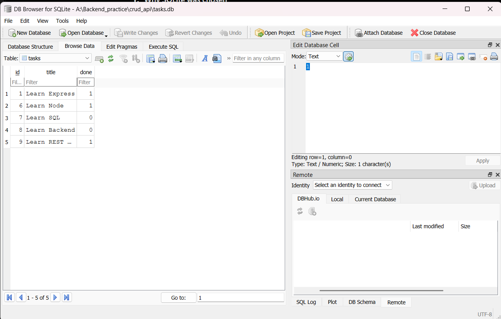
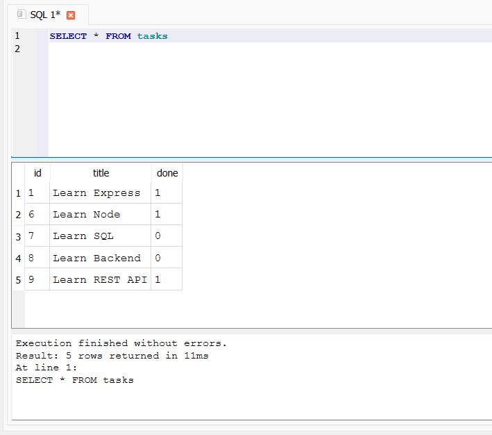
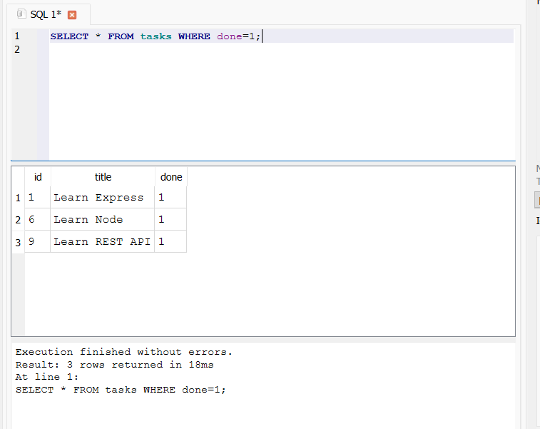

# 📋 Task API

A simple RESTful Task Management API built with **Node.js**, **Express.js**, **SQLite**, and **Swagger UI**.

This project is the Week 3 evolution of the CRUD API developed in Assignment 1. The API endpoints remain the same, while the storage layer has been migrated from in-memory data to a persistent SQLite database.

---

## ✨ Features

* Full CRUD operations for tasks
* Persistent SQLite database storage
* Automatic database creation
* Automatic `tasks` table creation
* Three initial tasks seeded only when the database is empty
* Data persists after server restarts
* Parameterized SQL queries
* Input validation
* Proper HTTP status codes
* Health check endpoint
* Swagger API documentation
* SQL database exploration using DB Browser for SQLite

---

## 🏗️ Architecture

```text
                    Client
                      │
                      ▼
              ┌───────────────┐
              │    Express    │
              │      API      │
              └───────┬───────┘
                      │
                      ▼
             ┌─────────────────┐
             │  better-sqlite3 │
             └────────┬────────┘
                      │
                      ▼
              ┌───────────────┐
              │    tasks.db   │
              │    SQLite DB  │
              └───────────────┘
```

The API layer continues to expose the same CRUD endpoints, while SQLite is responsible for persistent storage.

---

## 🛠️ Tech Stack

| Technology                | Purpose                               |
| ------------------------- | ------------------------------------- |
| **Node.js**               | JavaScript runtime                    |
| **Express.js**            | REST API framework                    |
| **better-sqlite3**        | SQLite database integration           |
| **SQLite**                | Persistent data storage               |
| **Swagger UI**            | Interactive API documentation         |
| **Git / GitHub**          | Version control and project hosting   |
| **DB Browser for SQLite** | Database inspection and SQL execution |

---

## 📁 Project Structure

```text
crud_api/
│
├── docs/
│   └── screenshots/
│       ├── database-browser.png
│       ├── sql-select-all.png
│       └── sql-completed-tasks.png
│
├── database.js          # SQLite connection, schema and seed logic
├── index.js             # Express server and API routes
├── openapi.json         # Swagger/OpenAPI specification
├── package.json         # Project dependencies
├── package-lock.json
├── .gitignore
├── README.md
└── tasks.db             # SQLite database created automatically
```

> `tasks.db` is generated locally when the application starts and is excluded from Git using `.gitignore`.

---

# 🗄️ Database

## Why SQLite?

SQLite was chosen because it provides:

* Persistent storage without requiring a separate database server
* A complete database in a single file
* Zero database-server configuration
* Simple integration with Node.js
* Data persistence across application restarts
* Easy inspection using DB Browser for SQLite

The database file used by this project is:

```text
tasks.db
```

It is created automatically when the application starts if it does not already exist.

---

## Database Schema

The application uses a single table named `tasks`.

| Column  | Type    | Description                            |
| ------- | ------- | -------------------------------------- |
| `id`    | INTEGER | Primary key generated by SQLite        |
| `title` | TEXT    | Task title                             |
| `done`  | BOOLEAN | Completion status stored as `0` or `1` |

Conceptually:

```text
tasks
├── id
├── title
└── done
```

SQLite automatically generates the task ID, so IDs remain independent of the number or position of tasks currently stored.

---

## 🔄 Database Initialization

When the application starts:

1. `tasks.db` is opened or created.
2. The `tasks` table is created if it does not already exist.
3. The application checks whether the table is empty.
4. Three example tasks are inserted only when there are no existing rows.
5. Existing data is preserved on subsequent restarts.

This prevents seed data from being duplicated every time the server starts.

---

# 📸 Database in DB Browser

The SQLite database was inspected using **DB Browser for SQLite**.



The database contains the `tasks` table with the `id`, `title`, and `done` columns.

---

# 🔌 API Endpoints

| Method   | Endpoint     | Description       | Success |
| -------- | ------------ | ----------------- | ------- |
| `GET`    | `/`          | API information   | `200`   |
| `GET`    | `/health`    | Health check      | `200`   |
| `GET`    | `/tasks`     | Get all tasks     | `200`   |
| `GET`    | `/tasks/:id` | Get a task by ID  | `200`   |
| `POST`   | `/tasks`     | Create a new task | `201`   |
| `PUT`    | `/tasks/:id` | Update a task     | `200`   |
| `DELETE` | `/tasks/:id` | Delete a task     | `204`   |

### Error responses

| Status | Meaning              |
| ------ | -------------------- |
| `400`  | Invalid request body |
| `404`  | Task not found       |

The API preserves the CRUD behavior from Assignment 1 while changing the underlying storage implementation to SQLite.

---

# 🧪 Testing the API

The API can be tested using Postman, curl, or any HTTP client.

## Get all tasks

```http
GET /tasks
```

Example:

```text
http://localhost:3000/tasks
```

---

## Get a task by ID

```http
GET /tasks/1
```

---

## Create a task

```http
POST /tasks
Content-Type: application/json
```

Request body:

```json
{
  "title": "Learn SQLite"
}
```

A successful request returns `201 Created` and the ID generated by SQLite.

---

## Update a task

```http
PUT /tasks/1
Content-Type: application/json
```

Example body:

```json
{
  "done": true
}
```

---

## Delete a task

```http
DELETE /tasks/1
```

A successful deletion returns:

```text
204 No Content
```

---

# 🔐 Parameterized Queries

Database operations use parameterized SQL queries rather than directly inserting user input into SQL statements.

For example:

```sql
SELECT * FROM tasks WHERE id = ?
```

The task ID is supplied separately as a parameter.

This approach prevents user-provided values from being directly concatenated into SQL statements.

---

# 🔎 SQL Exploration

The database was also explored directly using DB Browser for SQLite.

## Query 1 — View all tasks

```sql
SELECT * FROM tasks;
```

This query returns all rows currently stored in the `tasks` table.



---

## Query 2 — View completed tasks

```sql
SELECT * FROM tasks WHERE done = 1;
```

This query returns only the tasks whose completion status is `1`.



---

# 🔄 Persistence Test

One of the main goals of this assignment is persistence.

The API was tested by:

```text
Create task
     ↓
Store task in SQLite
     ↓
Stop server
     ↓
Start server again
     ↓
GET /tasks
     ↓
Previously created task still exists
```

This confirms that task data is stored in `tasks.db` rather than only in application memory.

---

# 🚀 Installation

Clone the repository:

```bash
git clone https://github.com/sathvik333m/CRUD_API.git
```

Enter the project directory:

```bash
cd crud_api
```

Install dependencies:

```bash
npm install
```

---

# ▶️ Running the Application

Start the server:

```bash
node index.js
```

The server runs at:

```text
http://localhost:3000
```

### Swagger Documentation

Open:

```text
http://localhost:3000/docs
```

Swagger UI provides an interactive interface for exploring and testing the API endpoints.

---

# 🗃️ Automatic Database Setup

No manual database setup is required.

After cloning the repository and installing the dependencies:

```bash
node index.js
```

the application automatically creates:

```text
tasks.db
```

and the required:

```text
tasks
```

table.

If the table is empty, the application inserts the three initial example tasks.

Therefore, a fresh clone can run the application without requiring the user to manually create the database.

---


